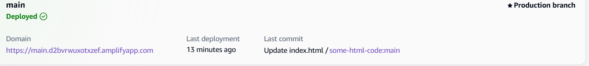

## Amplify
Platform provides Helps in 
- `Building`
, Deployment and Hosting`

**Problem**
1. Certificate.
2. https
3. Deployment

**How to deploy**
1. Choose source code provider
Github, BitBucket, CodeCommit, Gitlab
=> To manually deploy from s3 or zip
Choose deploy without github.

2. Add repository and branch
Github choose> Give your repo name and branch.

3. App Settings
like App name, 
Build settings: Build command, Build output directory
Advanced settings: (optional) If you want to add image, environment variables.

4. Review and deploy

**How to give custom domain**
1. You need `Amazon route 53` for giving the custom domain.
2. There you can add custom aws certificate or own certificate