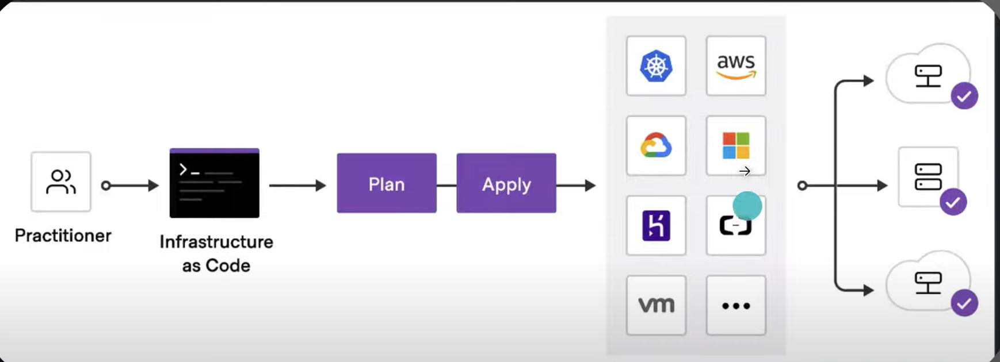

## Terraform Basics
Terraform is an open-source is an IAC(Infrastructure as code) tool.
Supports: AWS, GCP, AZURE
1. It mange infrastructure across multiple cloud providers using a declarative configuration language.

Details:
1. Cloud provider
2. Location.
3. Type of resource.

**Config**
- uses .tf extension or it can be json with extension as  .tf.json
- format is HCL(Hashicorp Config Language)
- Declarative Language.

**Architecture**
`Follows init, plan, apply/destroy`
commands
- terraform init
- terraform plan
- terraform apply

**Advantages**
- `Consistency`: define infrastructure as a code.
- `Automation`: Reduce manual work and cost efficient since we can destroy any time
- `Repeatable`: Replicate environments easily.

**State Management**
- The state file terraform.tfstate  maintains a detailed record of the current state of manged resources.
- The state file can be stored locally or remotely.

**Multiple resource using**
- count
- forEach

**Terraform Modules**
Module consist of collection of .tf files kept together in directory.
Modules are the main way to package and reuse configurations with Terraform.

**Workspace**

**Terraform cloud**
- remote state management.
- vcs
- automated runs

**Terraform Providers**
Aws, ATlas, oracle cloud, Azure
