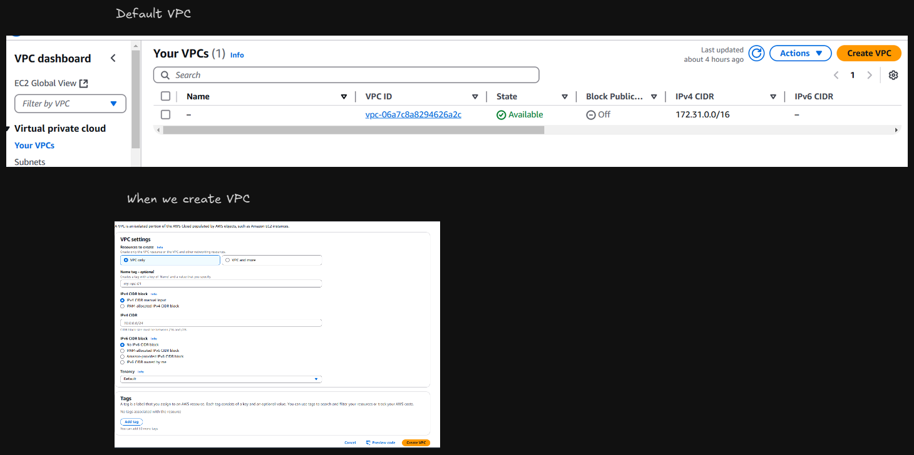
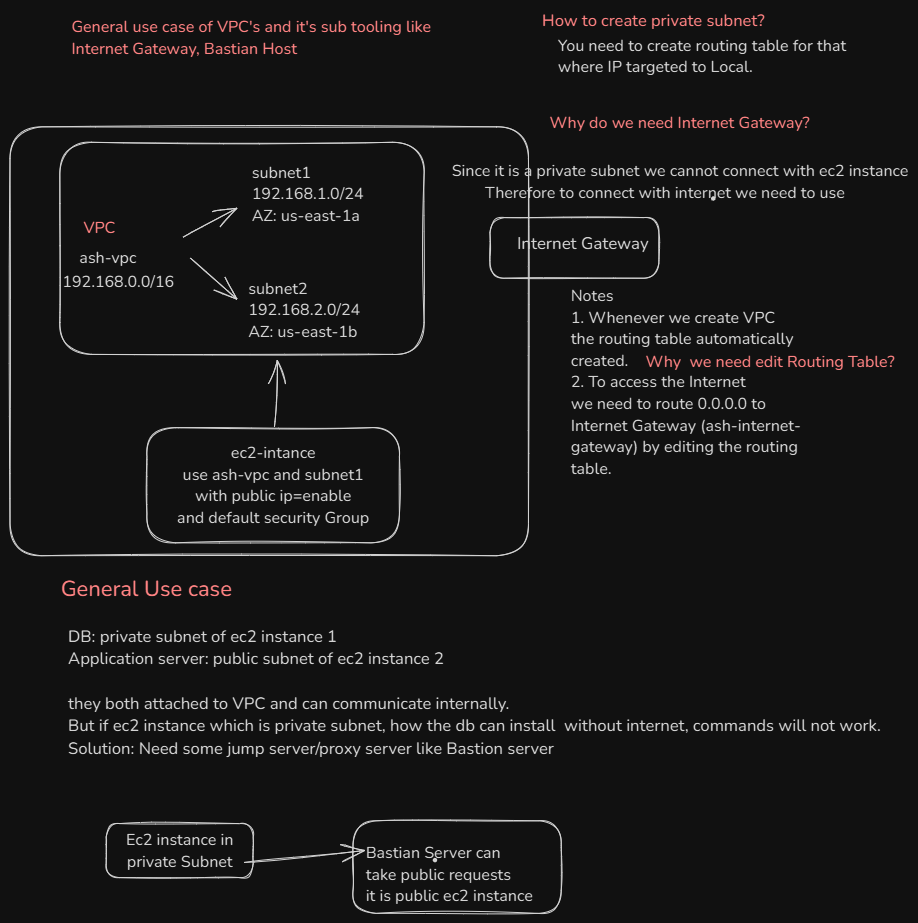
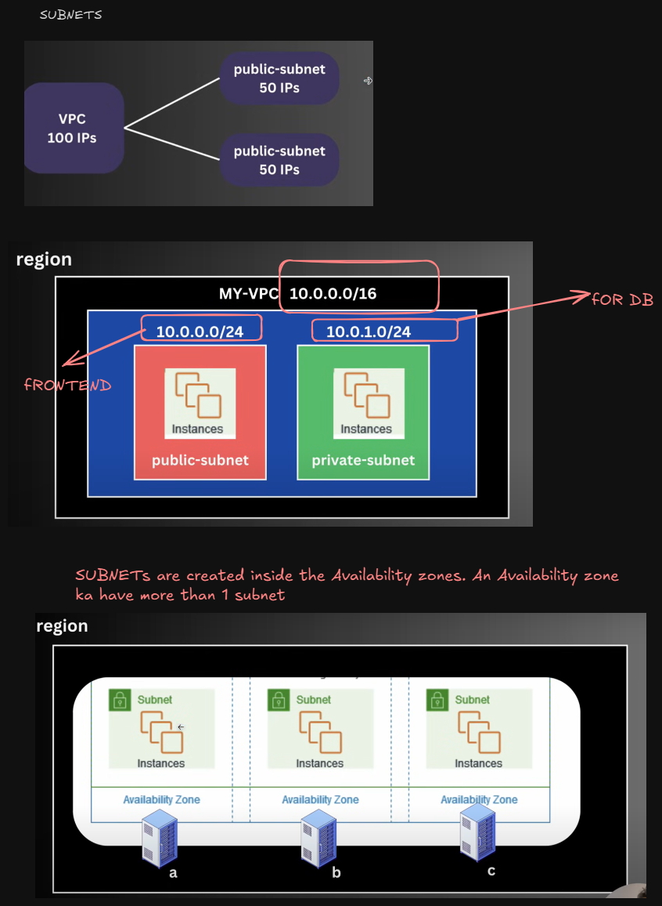
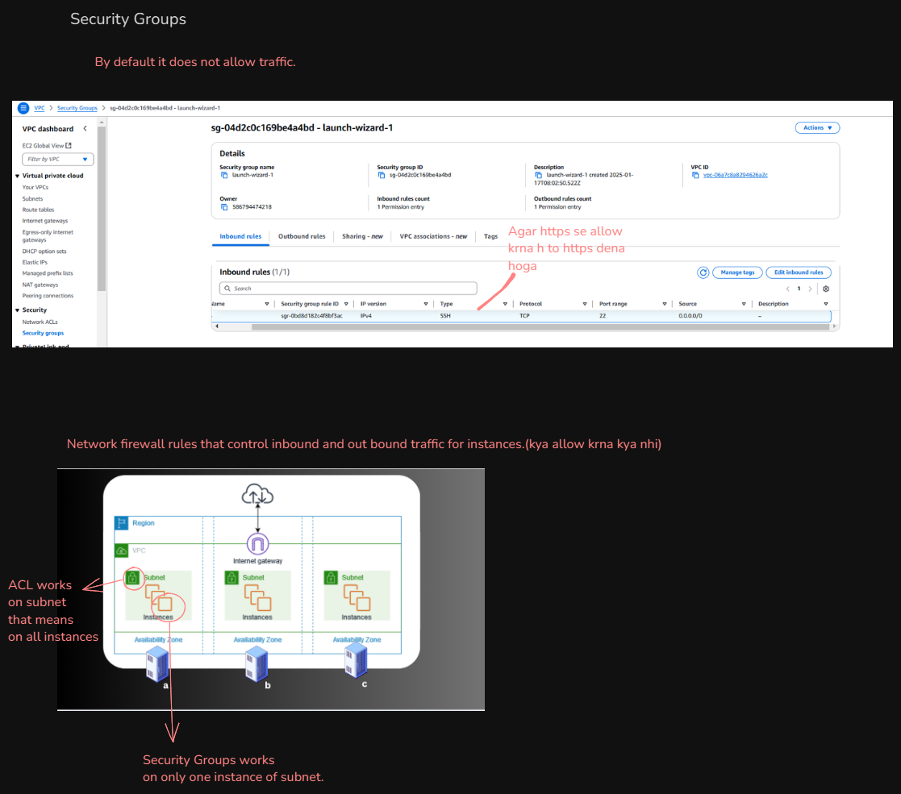
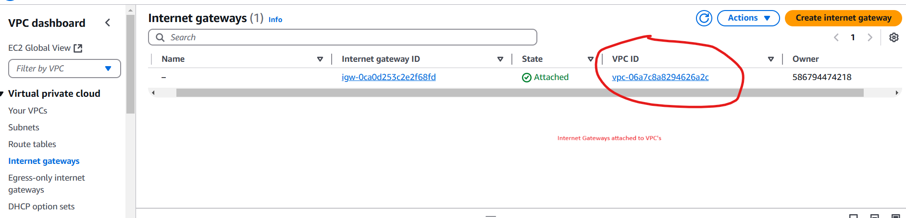

## VPC

A private, isolated network with in the AWS cloud where you can launch and manage your resources securely.
**Why**

- secure isolated network
- Additional layer of safety.

**USE case**

1. Website deploy with vpc in region-mumbai
   US, Asia, Europe
   further divide Asia: North, East, South
   further regions: East: Mumbai, Hyderabad
   Availability zones: Ek region k andar kai sare zone hote h
   Ex: Mumbai-a, Mumbai-b, Mumbai-c

2. When we create VPC, we create CIDR block.

3. 
## CIDR block

- CIDR: Class Inter Domain Routing .
- CIDR block define the IP ranges for the entire VPC. For ex:
  `10.0.0.0/16`
  This block allows: 65,536 IP addresses bun in reality(65,531 are usable)
- For Routing or allocation ip addresses and routing protocol IP address.
  CIDR.xyz

## Subnets

Smaller part of large network that isolates and organize devices with in specific IP address range

## Security Groups

## Internet Gateway:

This is attached to VPC. It allows the internet traffic to enter in the vpc.

## Network ACLs(Access Control Lists)

Optional Layer of security for VPC

- It act as firewall for controlling traffic for `in and out of one or more subnets`.
- It `allow or deny rules`

## Security Groups vs ACL

- ACL

1. Allow or deny rules
2. Works on subnet means all Instances.

- Security Groups

1. Only allow rules.
2. Works on only one instance of subnet.
