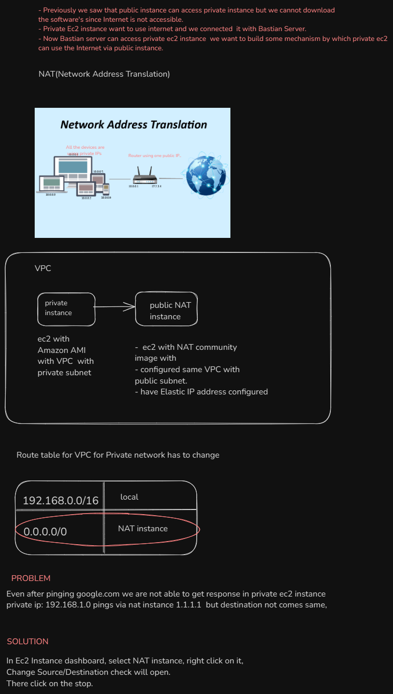

## NAT Instance and Nat Gateway
- Nat Instance
  1. AWS does not recomment NAT instance, because we have to mange EC2 instance, and instance can be so many.
  2. Scaliblity of NAT instance has to manage.
  3. Single Point of Failure

## NAT Gateway(Network Address Translation)

- Enables instances in a private subnet to connect to the Internet or other AWS services, but prevents the Internet from initiating connections to those interfaces.
- Enables One way communication.

  It means: Ki andar se Instance/db Internet use kar skta h, but bhar se Internet se koi Instance/DB access nhi kr skta.

  **Input**

  1. Name of the Nat(optional)
  2. Subnet: Select the subnet for which you want to create the NAT Gateway.
  3. Connectivity type: Public or Private.

**Steps to attach NAT gateway with private ec2 instance**
1. Create Nat Gateway
2. Assign Elastic Ip adress
3. Change in ROuting table private subnet of VPC by adding 0.0.0.0/16 to NAT Gateway.

⚠️ **This is the NAT instance**
Disadvanatages
1.  We need to handle nat ec2 instance like scaling or manging.
Better solution is NAT Gateway

